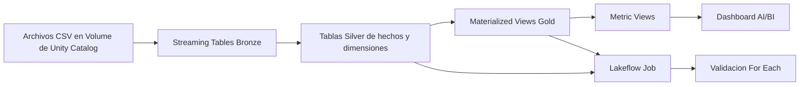

# Analitica Retail Lacrosse

Proyecto de Databricks que implementa una arquitectura medallion para analitica
retail: ingesta Bronze con Auto Loader, transformaciones Silver con CDC/SCD
Tipo 2, vistas materializadas Gold, Metric Views, un dashboard AI/BI y un Job de
Lakeflow.

## Pregunta de negocio

Que segmentos de clientes, ventas y tiendas generan mayor valor, y como puede
el negocio monitorear ingresos, volumen de transacciones y comportamiento de
clientes?

## Arquitectura



### Capas

- **Bronze:** archivos crudos de ventas, tiendas y CDC de clientes cargados con
  Auto Loader.
- **Silver:** datos limpios y tipificados, columnas derivadas, expectations de
  calidad y la dimension de clientes mantenida con `APPLY CHANGES INTO` como
  SCD Tipo 2.
- **Gold:** espejos materializados de los datasets Silver vigentes, usados como
  base para la capa semántica.
- **Monitoreo:** cada SDP publica su Event Log como una tabla Delta en Unity Catalog.
- **Capa semantica:** tres Metric Views creadas por tareas SQL del Job:
  `mv_customer_analytics`, `mv_sales_analysis` y `mv_store_performance`.
- **Dashboard:** dashboard Lakeview/AI-BI que consume las Metric Views en lugar
  de consultar directamente los objetos Gold.

## Estructura del repositorio

```text
databricks.yml                            Bundle y targets de ambiente
resources/lacrosse_pipeline.yml           SDP Bronze/Silver
resources/lacrosse_gold_pipeline.yml      SDP Gold
resources/lacrosse_orchestration_job.yml Job de Lakeflow
resources/retail_analytics_dashboard.yml Recurso del dashboard
src/bronze/                                Ingesta con Auto Loader
src/silver/                                Limpieza, expectations y CDC/SCD2
src/gold/                                  Metricas Gold y Metric Views
src/jobs/                                  SQL ejecutado por el Job
dashboards/                                Definicion del dashboard AI/BI
.github/workflows/dev.yaml                 CI/CD de development
.github/workflows/prod.yaml                CI/CD de production
```

## Ambientes

| Ambiente | Target del bundle | Catalogo | Schemas |
|---|---|---|---|
| Development | `development` | `dab_lacrosse_dev` | `01_bronze`, `02_silver`, `03_gold` |
| Production | `production` | `dab_lacrosse_prod` | `01_bronze`, `02_silver`, `03_gold` |

El SQL Warehouse utilizado por el Job esta configurado como `warehouse_id` en
`databricks.yml`. Cambialo si el workspace del target usa otro warehouse.

## Requisitos previos

- Databricks CLI instalado y disponible como `databricks`.
- Acceso al workspace de Databricks y a los catalogos de destino.
- Un SQL Warehouse disponible para las tareas SQL del Job.
- Archivos CDC y de ventas cargados en el Volume de Unity Catalog correspondiente:

```text
/Volumes/<catalog>/01_bronze/landing_zone/customers/
/Volumes/<catalog>/01_bronze/landing_zone/stores/
/Volumes/<catalog>/01_bronze/landing_zone/sales_transactions/
```

Los archivos CDC de clientes deben incluir una llave, una columna `operation` y
una columna de secuencia `updated_at`. Las operaciones soportadas son `INSERT`,
`UPDATE` y `DELETE`.

## Autenticacion local

Usa OAuth u otro metodo soportado por Databricks CLI. Nunca hagas commit de
credenciales en este repositorio.

Para GitHub Actions, configura estos secretos a nivel de Environment en `dev` y
`prod`:

```text
DATABRICKS_HOST
DATABRICKS_CLIENT_ID
DATABRICKS_CLIENT_SECRET
```

Los workflows tambien establecen explicitamente el catalogo mediante
`DATABRICKS_BUNDLE_VAR_catalog`.

## Validar y desplegar localmente

Validar development:

```bash
databricks bundle validate -t development --var catalog=dab_lacrosse_dev
```

Desplegar development:

```bash
databricks bundle deploy -t development --var catalog=dab_lacrosse_dev
```

Ejecutar manualmente el Job de orquestacion:

```bash
databricks bundle run -t development lacrosse_orchestration_job
```

Para production, usa el target y catalogo de production despues de verificar el
workflow de development:

```bash
databricks bundle validate -t production --var catalog=dab_lacrosse_prod
databricks bundle deploy -t production --var catalog=dab_lacrosse_prod
databricks bundle run -t production lacrosse_orchestration_job
```

## Flujo del Job

El Job de orquestacion ejecuta estas etapas:

1. Ejecutar el pipeline Bronze/Silver.
2. Ejecutar el pipeline Gold.
3. Crear o reemplazar las tres Metric Views con tareas SQL.
4. Usar una tarea `For Each` para validar que las tres Metric Views contengan datos.

El trigger por llegada de archivos observa el Volume de aterrizaje Bronze. El
Job tambien envia notificaciones por correo de exito y fallo segun su definicion
de recurso.

Los Event Logs se publican en Unity Catalog como:

```text
<catalog>.01_bronze.lacrosse_retail_event_log
<catalog>.03_gold.lacrosse_gold_event_log
```

Consulta un Event Log publicado con:

```sql
SELECT *
FROM dab_lacrosse_dev.01_bronze.lacrosse_retail_event_log
ORDER BY timestamp DESC
LIMIT 100;
```

El `For Each` usa un solo archivo SQL fijo e itera sobre nombres de vistas. No
intenta interpolar una ruta de archivo, porque las rutas de archivos del Bundle
se resuelven durante el despliegue y no durante la ejecucion del Job.

## Verificacion de CDC y SCD Tipo 2

Despues de ejecutar el primer batch CDC, captura el estado inicial. Luego carga
un segundo batch con al menos un insert y un update, ademas de un delete cuando
corresponda. Ejecuta nuevamente el pipeline Bronze/Silver y verifica el historial:

```sql
SELECT
    customer_id,
    first_name,
    last_name,
    __START_AT,
    __END_AT,
    __IS_CURRENT
FROM dab_lacrosse_dev.02_silver.dim_customers
ORDER BY customer_id, __START_AT;
```

El registro actual se identifica con `__END_AT IS NULL` o
`__IS_CURRENT = true`; una version anterior debe tener un timestamp de cierre.

## Verificacion del dashboard

Los datasets del dashboard apuntan a las Metric Views de development o
production, segun el catalogo generado por el workflow. Verifica estos objetos
antes de la presentacion:

```sql
SELECT COUNT(*) FROM dab_lacrosse_dev.03_gold.mv_customer_analytics;
SELECT COUNT(*) FROM dab_lacrosse_dev.03_gold.mv_sales_analysis;
SELECT COUNT(*) FROM dab_lacrosse_dev.03_gold.mv_store_performance;
```

El dashboard debe consultar las Metric Views y no directamente las materialized
views Gold.

## Flujo CI/CD

- Pull request hacia `dev`: valida el Bundle de development.
- Push hacia `dev`: valida, despliega development y ejecuta el Job de orquestacion.
- Pull request hacia `main`: valida el Bundle de production.
- Push hacia `main`: valida, despliega production y ejecuta el Job de orquestacion.

Los Environments `dev` y `prod` aislan sus credenciales OAuth. Agrega revisores
obligatorios al Environment `prod` cuando se requiera aprobacion para production.

## Gobernanza con Unity Catalog

Otorga al docente acceso solamente a la Metric View o al dashboard de production.
No otorgues acceso a datos Silver, al catalogo de development ni al Job. Ejemplo
de SQL, usando el correo real del docente y el nombre final del objeto:

```sql
GRANT SELECT ON TABLE dab_lacrosse_prod.03_gold.mv_customer_analytics
TO `instructor@example.com`;
```

Registra el grant real y su verificacion como parte de la evidencia de entrega.

## Checklist de entrega

- [ ] Corridas exitosas de los pipelines Bronze/Silver y Gold.
- [ ] Evidencia de CDC/SCD Tipo 2 para batch 1 y batch 2.
- [ ] Corrida exitosa del Job, incluyendo las tres iteraciones de `For Each`.
- [ ] Evidencia del trigger por llegada de archivos.
- [ ] Captura del dashboard con datos y al menos dos tipos de visualizacion.
- [ ] Evidencia de validacion, despliegue y ejecucion del Job en development.
- [ ] Evidencia de validacion, despliegue y ejecucion del Job en production.
- [ ] Evidencia del grant de Unity Catalog solo en production.
- [ ] Event Logs publicados en Unity Catalog y evidencia capturada para ambos SDP.
- [ ] Documento de decisiones con diagramas de arquitectura y CI/CD.
