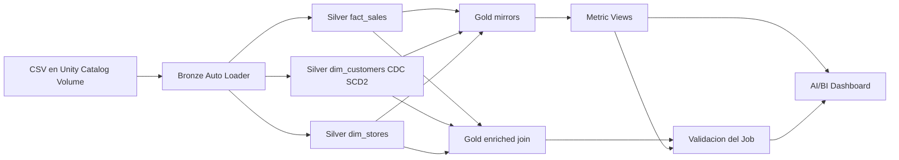

# Documento de decisiones
## Proyecto Final Módulo 03 Técnico en Ingeniería de Datos con Databricks

**Estudiante:** Alfredo Castro Ortiz  
**Repositorio:** `alkztro-95/mod_03_dab_lacrosse`  
**Fecha:** 25 de agosto de 2026  
**Ambientes:** `development` y `production`

> Este documento describe las decisiones de arquitectura, transformacion,
> orquestacion, despliegue y gobernanza del proyecto final.

## 1. Dataset y caso de negocio

El proyecto utiliza un dataset de ventas retail con transacciones, clientes,
tienda, producto, categoria, cantidades, precios, descuentos, metodo de pago y
fecha de transaccion. El dataset tiene una tabla de hechos de ventas `sales_transactions`  y
lookup/dimensiones de clientes `customers` y tiendas `stores`.

El dataset es sintetico y fue generado con asistencia de GitHub Copilot usando
la libreria de Python `Faker`. Esta herramienta permitio crear datos realistas sin utilizar informacion personal real.
Los archivos generados se cargaron al Volumen `landing_zone` y se utilizaron como
fuente de Auto Loader para la capa Bronze.

La dimension seleccionada para CDC es `customers`, porque sus atributos pueden
cambiar con el tiempo y esos cambios afectan directamente el análisis de
segmentación y valor de cliente. Los registros de clientes incluyen una clave
`customer_id`, una columna `operation` y una columna `updated_at` que funciona
como secuencia de los cambios.

La pregunta de negocio es:

> Que segmentos de clientes, ventas y tiendas generan mayor valor, y como puede
> el negocio monitorear ingresos, volumen de transacciones y comportamiento de
> clientes?

Esta pregunta se responde con las Metric Views `mv_customer_analytics`,
`mv_sales_analysis` y `mv_store_performance`, que exponen medidas de negocio y
dimensiones comprensibles para el dashboard AI/BI.

## 2. Arquitectura general



El Bundle se define en `databricks.yml` y separa los ambientes mediante
catalogos distintos:

| Ambiente | Target | Catalogo | Schemas |
|---|---|---|---|
| Development | `development` | `dab_lacrosse_dev` | `01_bronze`, `02_silver`, `03_gold` |
| Production | `production` | `dab_lacrosse_prod` | `01_bronze`, `02_silver`, `03_gold` |

Esta separacion evita que una ejecucion de development escriba en production.
Las credenciales OAuth M2M se mantienen fuera del codigo y se configuran como
secrets de los GitHub Environments `dev` y `prod`.

## 3. Decisiones por capa

### Bronze

La capa Bronze ingiere los archivos mediante Auto Loader usando `cloud_files`.
Se conservan las columnas originales y se agregan `_ingestion_timestamp` y
`_source_file` para trazabilidad. El hecho principal es el archivo de ventas y
la fuente CDC de clientes se ingiere separadamente.

Las rutas de entrada son:

```text
/Volumes/<catalog>/01_bronze/landing_zone/customers/
/Volumes/<catalog>/01_bronze/landing_zone/stores/
/Volumes/<catalog>/01_bronze/landing_zone/sales_transactions/
```

Conservar los datos crudos en Bronze permite reprocesar y auditar la fuente sin
mezclar reglas de limpieza con la ingesta.

### Silver

`fact_sales` limpia y tipifica la informacion de ventas. Entre las decisiones
aplicadas estan:

- `CAST` para cantidades, precios, descuentos, total y fechas.
- `TRIM` para nombres, ciudades, regiones, categorias y otros textos.
- `UPPER` para normalizar metodos de pago y regiones.
- Columnas derivadas `discount_percentage`, `is_high_value`,
  `transaction_date_only`, `transaction_year`, `transaction_month` y
  `transaction_day_of_week`.
- Expectations para evitar o controlar datos invalidos:
  - **`WARN`:** `total_amount > 0`. Los importes no positivos se advierten
    porque pueden representar devoluciones o ajustes que deben investigarse,
    pero no bloquean la ingesta.
  - **`DROP ROW`:** `customer_id IS NOT NULL AND store_id IS NOT NULL`. Las
    transacciones sin referencias validas se descartan porque no pueden
    relacionarse confiablemente con las dimensiones.
  - **`FAIL UPDATE`:** `store_id IS NOT NULL`. Un store sin identificador hace
    fallar la actualizacion porque rompe la integridad referencial.
  - **`DROP ROW`:** la region debe pertenecer al conjunto de regiones validas.
    Una region invalida se descarta para evitar propagar una clasificacion
    incorrecta.

### CDC y SCD Tipo 2

`dim_customers` se mantiene con:

```sql
APPLY CHANGES INTO ${catalog}.${schema_silver}.dim_customers
FROM STREAM(${catalog}.${schema_bronze}.bronze_customers)
KEYS (customer_id)
APPLY AS DELETE WHEN operation = 'DELETE'
SEQUENCE BY updated_at
COLUMNS * EXCEPT (operation, _rescued_data, _ingestion_timestamp, _source_file)
STORED AS SCD TYPE 2;
```

Databricks administra las columnas de vigencia. `__START_AT` representa el
inicio de una version y `__END_AT` su final. La version vigente tiene
`__END_AT IS NULL`.
Cuando llega un update, la version anterior se cierra y se crea una nueva. Un
insert crea una version nueva y un delete cierra la version vigente conforme a
la regla CDC definida.

### Gold

El Gold SDP contiene espejos materializados de los datasets Silver actuales y
una vista materializada enriquecida:

```text
<catalog>.03_gold.gold_dim_customers
<catalog>.03_gold.gold_fact_sales
<catalog>.03_gold.gold_dim_stores
<catalog>.03_gold.gold_customer_sales_store_enriched
```

`gold_customer_sales_store_enriched` une `fact_sales`, `dim_customers` y
`dim_stores`. El join temporal con clientes utiliza la version valida en la
fecha de la transaccion:

```sql
f.customer_id = c.customer_id
AND f.transaction_date >= c.__START_AT
AND (c.__END_AT IS NULL OR f.transaction_date < c.__END_AT)
```

El intervalo es semiabierto: incluye el inicio y excluye el final. Esto evita
que una transaccion en el instante de cambio quede asociada simultaneamente a
dos versiones del cliente.

### Metric Views

Las Metric Views se crean como tareas SQL posteriores al Gold pipeline, porque
la sintaxis `WITH METRICS` no es una sentencia aceptada por el SDP utilizado.
Sus nombres son:

- `mv_customer_analytics`: medidas de clientes y valor de vida, con dimensiones
  de nivel de lealtad, estado, ciudad y cliente.
- `mv_sales_analysis`: ingresos, transacciones, valor promedio, unidades y
  descuentos, con dimensiones temporales, region, categoria y metodo de pago.
- `mv_store_performance`: ingresos, transacciones, clientes y unidades por
  tienda, region, ciudad y tipo de ubicacion.

El dashboard consume estas Metric Views, no consulta directamente las tablas
Silver. Los datasets del dashboard se resuelven por ambiente hacia el catalogo
correspondiente.

## 4. Orquestacion con Lakeflow Jobs

El Job `lacrosse_orchestration_job` se define como codigo en
`resources/lacrosse_orchestration_job.yml`.

El DAG ejecuta:

1. Pipeline Bronze/Silver.
2. Pipeline Gold.
3. Validacion de que `gold_customer_sales_store_enriched` contiene registros.
4. Creacion o reemplazo de las tres Metric Views.
5. Validacion `For Each` de las tres Metric Views.
6. Refresco del dashboard AI/BI.

La validacion usa un archivo SQL fijo, `validate_metric_view.sql`, y recibe el
objeto a revisar mediante el parametro `table_name`. El `For Each` itera sobre
los nombres de las tres Metric Views; no intenta construir rutas dinamicas de
archivos, porque las rutas de archivos se resuelven durante el despliegue.

La validacion de Gold usa `assert_true(COUNT(*) > 0, ...)`. Si el dataset esta
vacio, la tarea falla y las tareas dependientes no se ejecutan. El Job tiene
`email_notifications` para `on_success` y `on_failure`, dirigidas a
`alfredo.castro@ulatina.net`.

El trigger `file_arrival` observa:

```text
/Volumes/<catalog>/01_bronze/landing_zone/
```

Los Event Logs de los pipelines se publican en Unity Catalog:

```text
<catalog>.01_bronze.lacrosse_retail_event_log
<catalog>.03_gold.lacrosse_gold_event_log
```

## 5. CI/CD

La estrategia de ramas utiliza `dev` para integracion y `main` para production.
Los workflows se encuentran en `.github/workflows/`.

```mermaid
flowchart LR
    A[Feature branch] --> B[Pull Request a dev]
    B --> C[Validate development]
    C --> D[Merge a dev]
    D --> E[Validate development]
    E --> F[Deploy development]
    F --> G[Run Job development]
    G --> H[Pull Request dev a main]
    H --> I[Validate production]
    I --> J[Merge a main]
    J --> K[Deploy production]
    K --> L[Run Job production]
```



En `dev`, un Pull Request ejecuta validacion. Un push a `dev` ejecuta:

```text
validate -> deploy -t development -> run -t development
```

En `main`, un Pull Request valida production y un push ejecuta:

```text
validate -> deploy -t production -> run -t production
```

`DATABRICKS_HOST`, `DATABRICKS_CLIENT_ID` y `DATABRICKS_CLIENT_SECRET` se
configuran como Environment secrets. El catalogo se define por ambiente con
`DATABRICKS_BUNDLE_VAR_catalog`.

**Evidencia del flujo CI/CD:**  
GitHub Repo: https://github.com/alkztro-95/mod_03_dab_lacrosse. 


## 6. Gobernanza con Unity Catalog

El acceso de la persona docente debe limitarse a una Metric View o al dashboard
de production. No se deben compartir Silver, el catalogo de development ni el
Job.

Ejemplo de permiso, reemplazando el correo por el real:

```sql
GRANT SELECT ON TABLE dab_lacrosse_prod.03_gold.mv_customer_analytics
TO `<correo-del-docente>`;
```

La evidencia requerida es la confirmacion del grant o una captura de Share del
dashboard con permiso `Can view`.

**Evidencia de gobernanza:** 


## 7. Pruebas funcionales y evidencia

### Prueba CDC/SCD Tipo 2

**Batch 1:** cargar los registros iniciales y capturar la dimension Silver.

**Batch 2:** cargar al menos:

- un nuevo cliente con `operation = 'INSERT'`;
- un cliente existente actualizado con `operation = 'UPDATE'`;
- un delete si el caso de negocio lo contempla.

Consulta para demostrar el historial:

```sql
SELECT __start_at, __end_at, * FROM `02_silver`.dim_customers
WHERE customer_id IN (5, 14)
ORDER BY customer_id, __START_AT;
```

El resultado esperado es que el nuevo cliente aparezca, que la version anterior
del cliente actualizado tenga `__END_AT` poblado y que la nueva version tenga
`__END_AT IS NULL`.

**Evidencia:**


### Prueba del Job y dashboard

Capturar una corrida donde se observen:

- Bronze/Silver exitoso.
- Gold exitoso.
- Validacion de Gold enriquecido.
- Creacion de las tres Metric Views.
- Las tres iteraciones de `For Each`.
- Refresco exitoso del dashboard.
- Trigger `file_arrival`, si la corrida fue disparada por archivos.

**Evidencia:**


### Prueba de production

Capturar el Pull Request de `dev` a `main`, el check de validacion, el deploy y
la ejecucion del Job en production. Confirmar mediante una consulta que los
objetos existan en `dab_lacrosse_prod` y que el dashboard use las vistas de
production.

**Evidencia:**


## 8. Reflexion

La parte mas desafiante fue coordinar las diferencias entre los tipos de SQL
aceptados por el SDP, las Metric Views y las tareas SQL de Lakeflow. Las Metric
Views se retiraron del pipeline declarativo y se ejecutan despues del Gold
pipeline porque `WITH METRICS` no es una sentencia DLT aceptada en ese contexto.

Otro aprendizaje fue que los resultados de un `sql_task` no se publican
automaticamente como `tasks.<task>.values.<column>`. Por eso la validacion se
implemento como una tarea que falla directamente cuando el conteo es cero, y el
Job usa `For Each` para revisar las tres vistas con un archivo SQL fijo.

La separacion de catalogos, los Event Logs en Unity Catalog y los secretos por
Environment permiten que el mismo proyecto sea reproducible en development y
production sin exponer credenciales ni mezclar datos entre ambientes.
